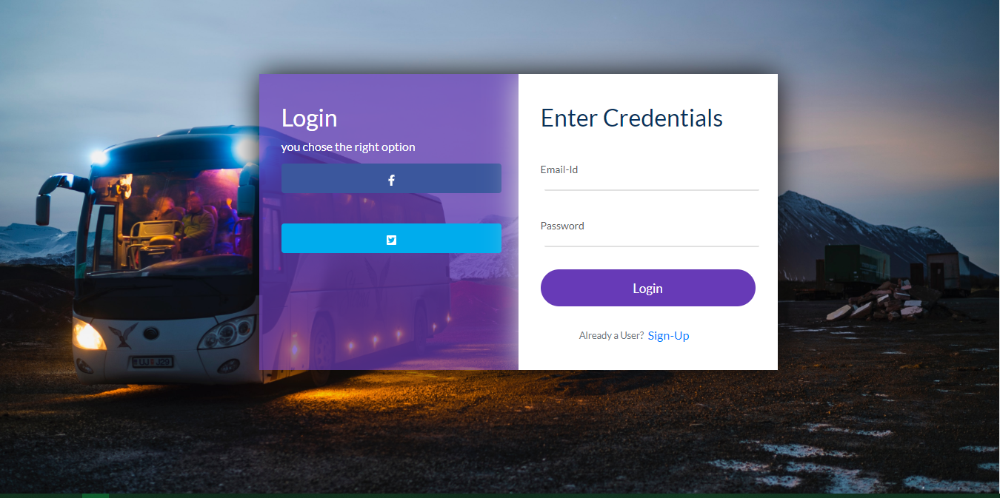
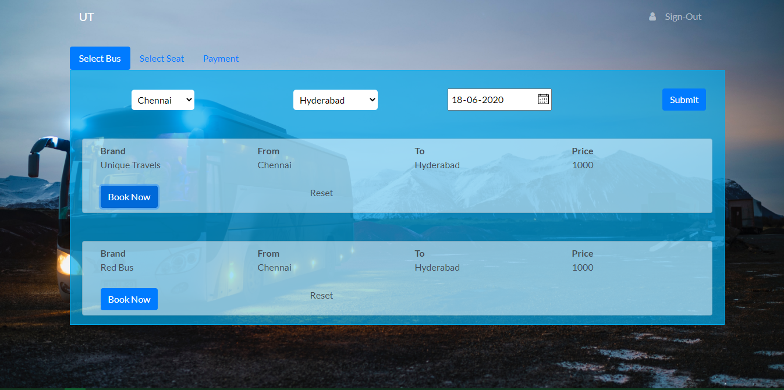

# MERN Bus Booking App

## 🚀 Overview
MERN Bus Booking App is a full-stack web application built using the **MERN (MongoDB, Express.js, React.js, Node.js) Stack**. It allows users to **search, book, and manage bus tickets** with features such as authentication, real-time seat availability, payment integration, and an admin panel.

## ✨ Features
- 🚌 **Bus Search & Booking** – Search for available buses and book seats in real-time.
- 🔐 **User Authentication** – Register, log in, and manage your profile.
- 🎫 **Ticket Management** – View and cancel booked tickets.
- 💳 **Payment Integration** – Secure payments using Stripe.


## 🏗️ Tech Stack
- **Frontend:** React.js, Redux, Tailwind CSS
- **Backend:** Node.js, Express.js, MongoDB
- **Authentication:** JWT (JSON Web Token)
- **Database:** MongoDB (Mongoose ODM)
- **Payment Gateway:** Stripe

## 🚀 Getting Started

### 1️⃣ Clone the Repository
```sh
git clone https://github.com/rajdhokai/mern-bus-booking-app.git
cd mern-bus-booking-app
```

### 2️⃣ Install Dependencies
```sh
# Install backend dependencies
cd backend
npm install

# Install frontend dependencies
cd ../frontend
npm install
```

### 3️⃣ Configure Environment Variables
Create a `.env` file in the backend directory and add:
```sh
MONGO_URI=your_mongodb_connection_string
JWT_SECRET=your_jwt_secret_key
STRIPE_SECRET=your_stripe_secret_key
FRONTEND_URL=http://localhost:3000
```

### 4️⃣ Run the Application
```sh
# Start the backend server
cd backend
npm start

# Start the frontend
cd ../frontend
npm start
```

### 5️⃣ Open in Browser
Visit `http://localhost:3000` to use the app.

## 🚀 Deployment

### **Deploy Backend on Render**
1. Push your backend code to GitHub.
2. Sign in to [Render](https://render.com/) and create a new web service.
3. Connect your GitHub repo and deploy the backend.
4. Copy the deployed URL and update the frontend `.env` file.

### **Deploy Frontend on Vercel**
1. Push your frontend code to GitHub.
2. Sign in to [Vercel](https://vercel.com/) and create a new project.
3. Connect your GitHub repo and deploy the frontend.

## 📸 Screenshots
Landing Page:


Signing In Page:



Bus Selection Page:



Seat Selection Page:


Payment & Confirmation Page:


## 📜 License
This project is licensed under the MIT License.

---
Made with ❤️ by codebuster

